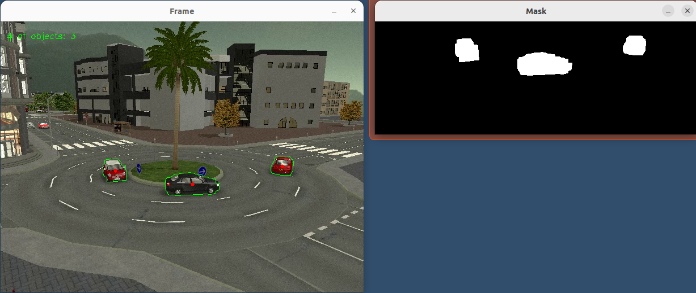

# Cars on roundabout

App written using OpenCV, and mainly based on "Mixture of Gaussian" algorithm.

## Algorithm
- select ROI - here roundabout
- decrease noise using Gaussian blur with mask $5 \times 5$
- remove background aka prepare mask that contains only moving objects
- apply morphological operators - specificly closing operation(dilation followed by erosion) to fill moving objects and then erosion to remove moving noise
- find countours of objects - now we have needed information
- calculate bounding boxes, middle points of them
- draw contours, points etc. to everythink looks impresive :)

